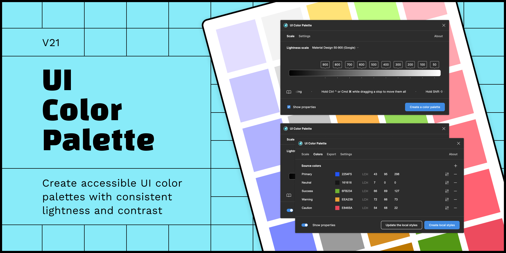

# Welcome aboard!

<figure><figcaption></figcaption></figure>

UI Color Palette is a Figma and Figjam plugin creating consistent and accessible Color Palettes. The plugin uses the `LCH model` to create colors according to the chosen lightness scale. This model is relevant to make colors compliant with the [WCAG standards](https://www.w3.org/WAI/standards-guidelines/wcag/). The idea to make this Figma plugin comes from that article: [Accessible Palette: stop using HSL for color systems](https://wildbit.com/blog/accessible-palette-stop-using-hsl-for-color-systems).

This plugin will allow you to:

* Create a complete palette from any existing color, that will help you build a color system
* Adjust the color palette in real-time to control the contrast
* Deploy the color palette by publishing it as local styles or exporting it as design tokens


To provide users with a quality experience, we want to inform them that source colors may not be included in the color palette due to the LCH color space. We recommend that users take this information into consideration before using the color palette.

The palette can still acknowledge if a color shade is close to the source in order to preserve the color language of your brand.

Thank you for your trust. Please do not hesitate to [contact us](mailto:hello@ui-color-palette.com) if you have any questions or concerns.

