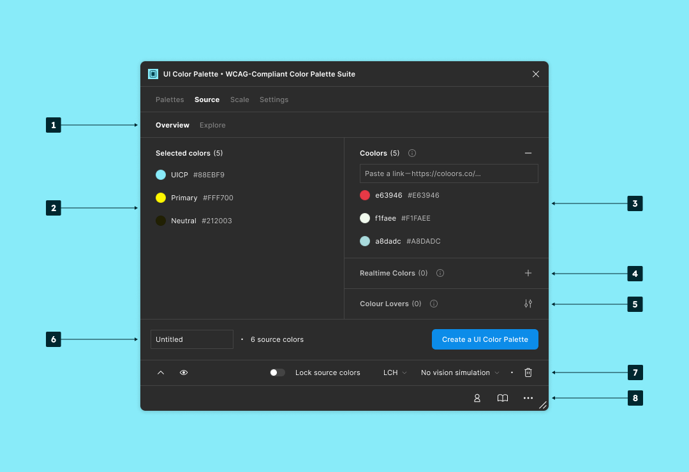
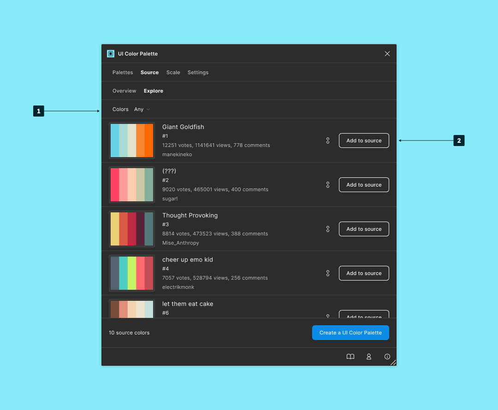
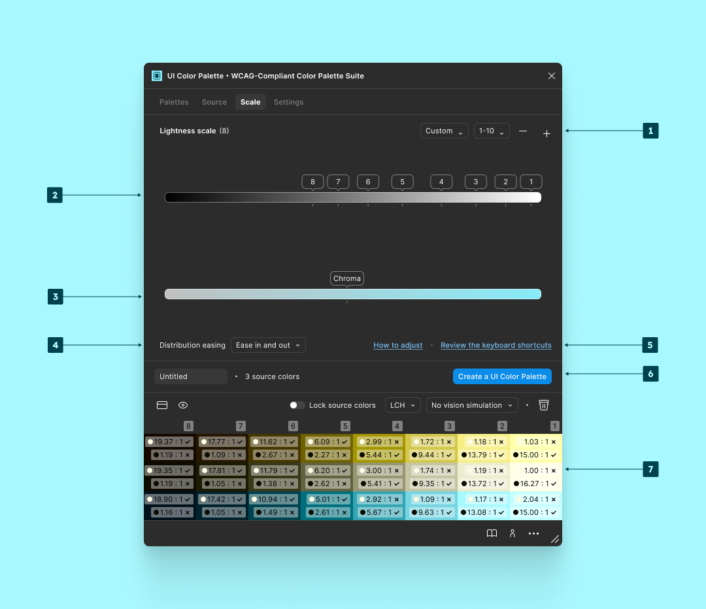
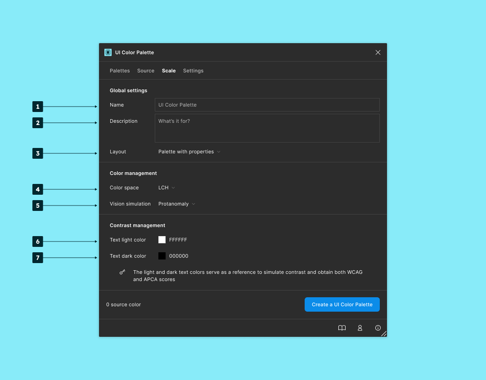

# 👀 Overview

<figure><figcaption>
<code>Source</code> <code>Overview</code>
</figcaption></figure>

1. Browse the contexts:
   * `Overview`: Colors import and recap'.
   * `Explore`: List of shared color combinations provided by the [`Colour Lovers`](https://www.colourlovers.com/) community.
2. The `Selected colors` from the document canvas.
3. Import from a [`Coolors`](https://coolors.co/) palette.
4. Import from a [`Realtime Colors`](https://www.realtimecolors.com/?colors=050315-fbfbfe-2f27ce-dedcff-433bff\&fonts=Inter-Inter) simulation.
5. Import from a [`Colour Lovers`](https://www.colourlovers.com/) palette.
6. Recap' of the `source colors`.
7. Access shortcuts:
   * Open the docs.
   * Open `User menu`.
   * Open `Help menu`.

***

<figure><figcaption>
<code>Source</code> <code>Explore</code>
</figcaption></figure>

1. Filter from a `Colors` list.
2. Run the actions:
   1. Click the link icon to access the palette.
   2. Click `Add to source` to bind the `source colors`.

***

<figure><figcaption>
<code>Scale</code>
</figcaption></figure>

1. Select a `Lightness scale` preset.
2. Adjust the `Lightness scale`'s stops.
3. Select a `Distribution easing`.
4. `Review the keyboard shortcuts`.
5. Create the palette according to both the `Lightness scale` and the `Settings`.

***

<figure><figcaption>
<code>Settings</code>
</figcaption></figure>

1. Change the palette `Name`.
2. Change the palette `Description`.
3. Change the palette `Layout`.
4. Select the `Color space`.
5. Select a `Vision simulation`.
6. Adjust the `Text light color`.
7. Adjust the `Text dark color`.
