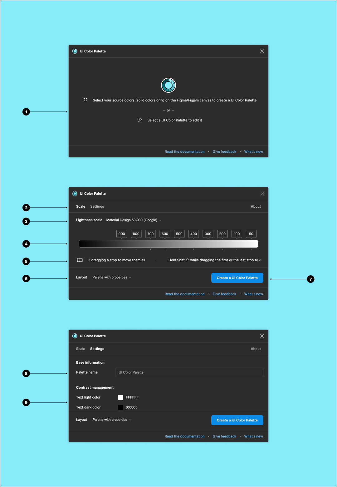

# Overview

<figure><figcaption></figcaption></figure>

1. The `Selected colors` from the document canvas.
2. The selected colors from a `Coolors` palette or a `Realtime Colors` simulation.
3. Browse the inspector:
   1. `Scale`: `Lightness scale` configuration.
   2. `Settings`: Palette configuration.
4. Select a `Lightness scale` preset.
5. Adjust the `Lightness scale`'s stops.
6. Select a `Distribution easing`.
7. Create the palette according to both the `Lightness scale` and the `Settings`.
8. Change the palette `Name`.
9. Change the palette `Description`.
10. Change the palette `Layout`.
11. Select the `Color space`.
12. Select a `Vision simulation`.
13. Adjust the `Text light color` and `Text dark color` on the color shades.
