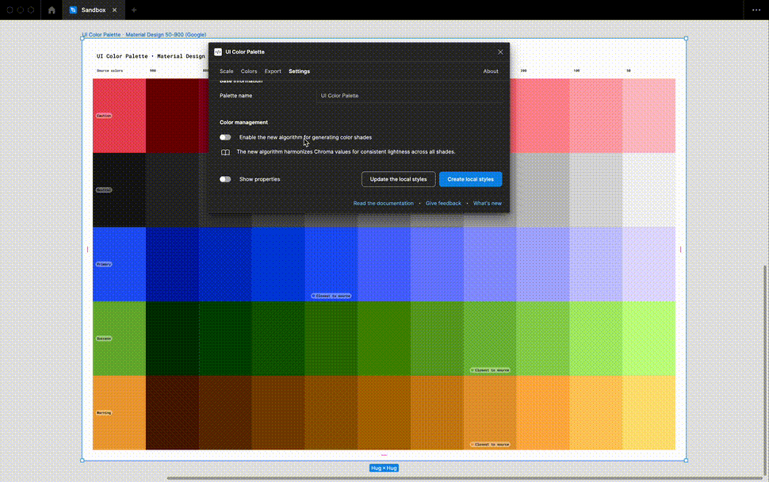

# Configure globally the palette

## Change the palette name

<figure><figcaption></figcaption></figure>

You can personalize your palette by changing its name in the `Settings`. The name can be up to 64 characters long, including spaces.

## Edit the text light and dark color

<figure><figcaption></figcaption></figure>

You have the option to customize the text colors used for simulating contrast between the color shade and accompanying text. This allows you to compare contrast using colors that are more relevant to your brand guidelines. While pure black `#000` and white `#FFF` are the default colors, you can now tailor them to better suit your needs.

## Enable the improved color shades generation

<figure><figcaption></figcaption></figure>

When you create a new palette, the improved color shade generation process is automatically used to generate every color shade from your source color. However, you'll need to manually enable this improved process for your existing palettes because it may significantly change the color shades. The improved process aims to harmonize the chroma and create a more consistent palette with slightly desaturated colors.
