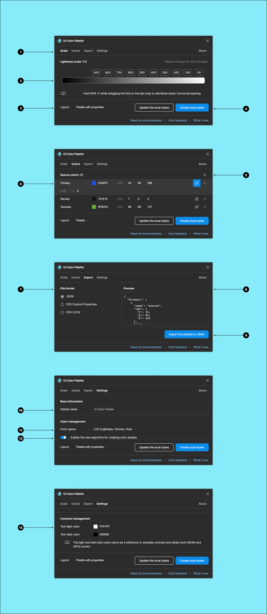

# Overview

<figure><figcaption></figcaption></figure>

1. Browse the inspector:
   1. `Scale`: `Lightness scale` configuration
   2. `Colors`: `Source colors` configuration
   3. `Export`: Color shades export to tokens
   4. `Settings`: Palette configuration
   5. `About`: Useful links
2. Tweak the `Lightness scale`'s stops
3. Display every color shade's properties
4. Turn every color shade into document local style or update them
5. Add a new color to the palette
6. Tweak the `Source colors` (from the left to the right):
   1. Color name
   2. Hexadecimal code
   3. LCH
   4. Advanced options
   5. Remove
   6. OKLCH mode toggle
   7. Hue range shifting
7. Export `File format`
8. Export `Preview`
9. Export the palette to the local machine
10. Change the `Palette name`
11. Edit the `Text light color` and `Text dark color` to tweak the contrast score
12. Generate color shades with new algorithm
