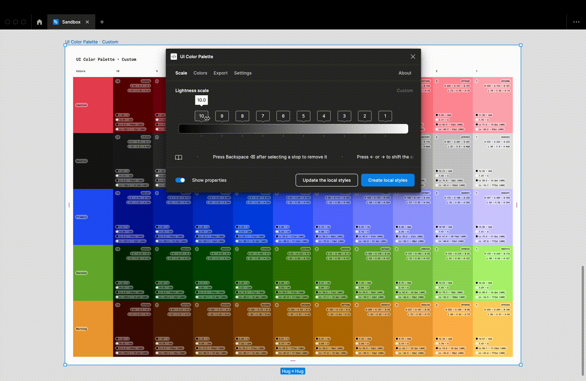
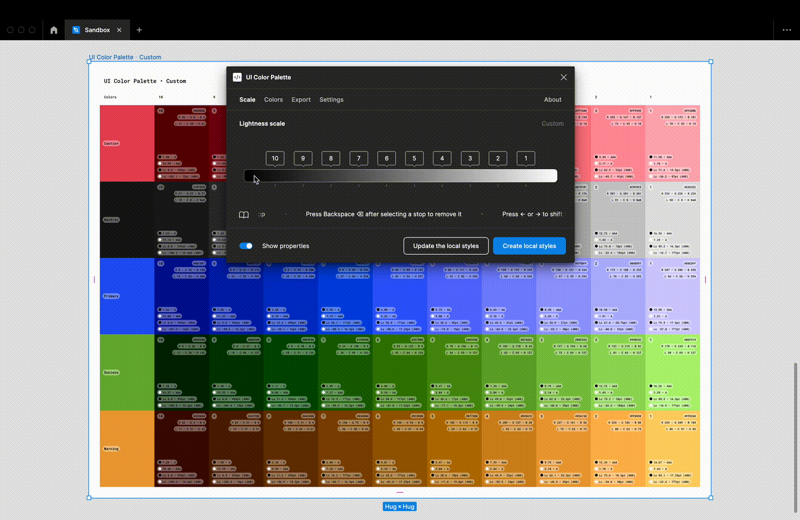

# Tweak the lightness stops


Better performance has been brought by hiding the properties when changing the lightness scale in real time



An acknowledgment appoints if the color shade is close to the source color


## Change the current stops

<figure><figcaption></figcaption></figure>

You can change the lightness scale in real-time via the slider. Note that is possible to use the same shortcuts as the creation.


You can tweak a stop with more accuracy by selecting it and press the arrow keys. The default nudge amount is 1% (reduced to 0.1% if the`Cmd ⌘` (macOS) or `Ctrl ⌃` (Windows) is pressed)


## Add or remove stops in `Custom` preset

<figure><figcaption></figcaption></figure>

Click on the range to add a new stop. Select a stop, then press `Backspace ⌫` to remove it. The stops could renamed to keep a consistent order.


The adding and the removing only work in `Custom` preset

