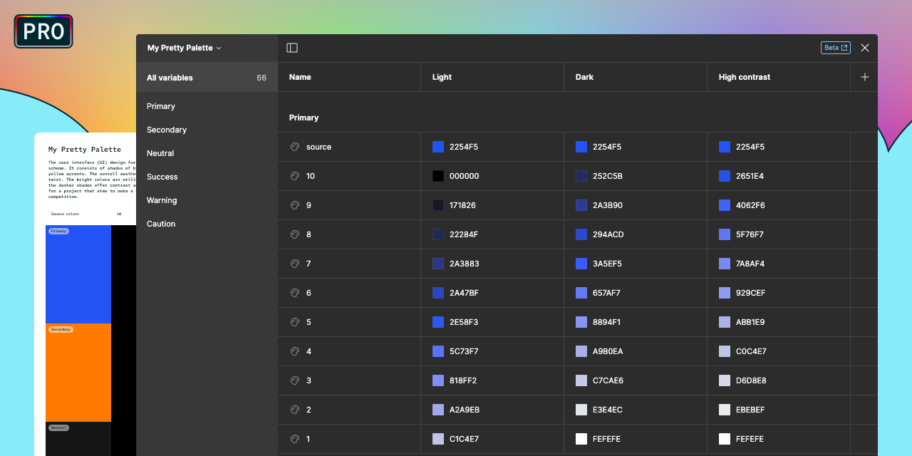
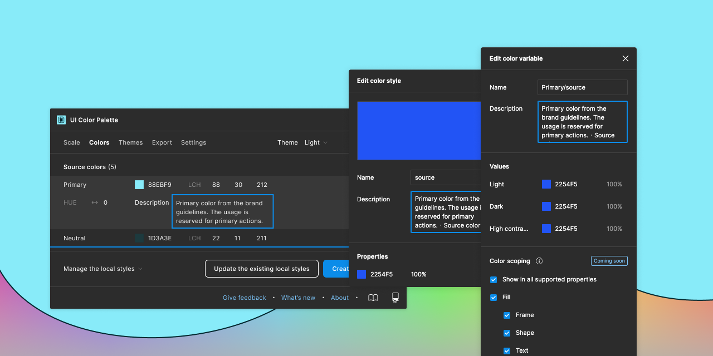
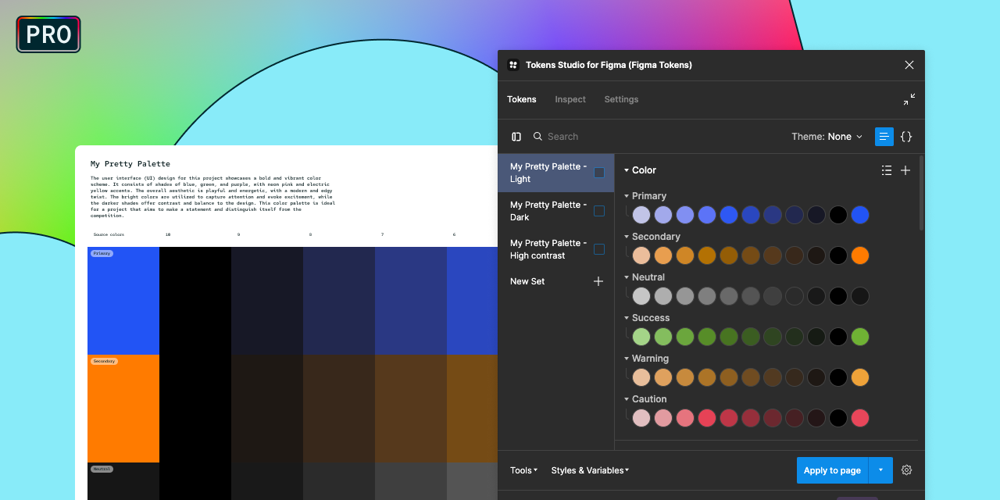
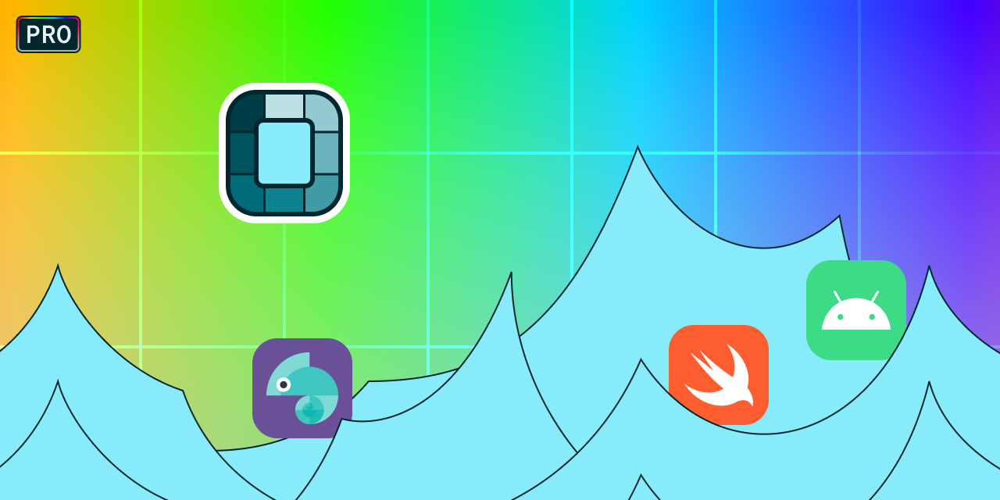
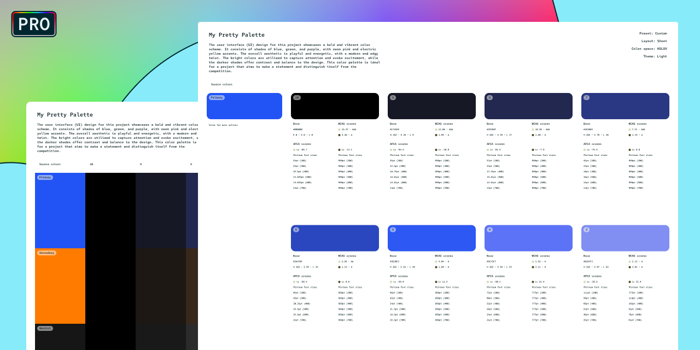
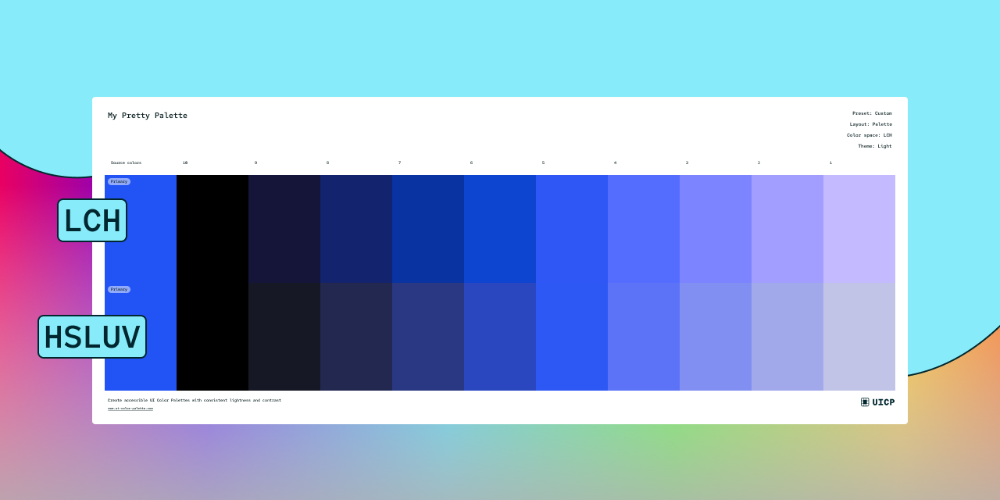

# UI Color Palette 24

> The Pro plan is now available for UI Color Palette! By subscribing, you will have access to additional features such as color themes, more export options, and the ability to create variables that can transform your color palette into a color system.
>
> Upgrade now and take your color palette to the next level!

## Key Feature



You can manage color themes within the same palette, allowing you to create multiple variations of lightness scales to build your color system. This feature is useful for managing both light and dark mode themes.

Additionally, local styles are grouped together by color theme, improving data organization and making it easier to navigate.

## Improvements

### Sync your palette with the local variables・Pro

<figure><figcaption></figcaption></figure>

The values of the shades can be assigned to the document's local variables. As seen in the Figma Config, variables allow for dynamic changes, increasing productivity. This feature also makes it easier to switch between modes.

### Bring more information to your color palette

<figure><figcaption></figcaption></figure>

You can describe the palette, including its source colors and color themes. This description is reported in the local styles and variables, as well as in the global tokens file in JSON format.

### Import your color palette into Tokens Studio・Pro

<figure><figcaption></figcaption></figure>

You can export your palette to JSON format to use with Tokens Studio, which adds more semantics to your shades. Learn more about [Tokens Studio](https://tokens.studio/).

### Export the color palette in multiple ways・Pro

<figure><figcaption></figcaption></figure>

#### Import your color palette into Amazon Style Dictionary

You can export your color palette in JSON format to use with Amazon Style Dictionary, which generates stylesheets for multiple platforms. Learn more about [Amazon Style Dictionary](https://amzn.github.io/style-dictionary/#/README).

#### Declare resources for Apple and Android projects

You can export your color palette to Swift (for use in an Xcode project) and XML (for use in an Android Studio project) formats.

### Transform you palette into a detailed document・Pro

<figure><figcaption></figcaption></figure>

The color sheet layout provides more details about usage, including recommendations on minimum font size and a structured organization.

### Try the HSLuv color space

<figure><figcaption></figcaption></figure>

The HSLuv color space has been added to the color space options, providing you with an additional choice to ensure consistency in your color scaling. To learn more about the [HSLuv color space model](https://www.hsluv.org/).

## Minor Changes

* The global tokens JSON structure now includes types.
* The controller has been adjusted:
  * A loader has been added to indicate when the controller is loading.
  * The message ticker no longer operates on hover.
  * The "About" section has been moved to the shortcuts.
  * The Github repository of the project is easily accessible.
  * The link to create an issue has been updated.
* The palette has been adjusted:
  * Auto Layout now uses the Wrap mode for the color sheet.
  * The text tag has larger padding.
  * The typography has been updated to Red Hat Mono.
  * A signature has been added at the bottom.
  * A message has been added to the palette that appears when there are no source colors.
* Styles are now tracked with an ID to ensure that the name is updated correctly.
* The license has been updated to ensure that it is up to date and compliant with current regulations.

## Bug Fixes

* You are no longer able to edit the palette by selecting a child element, preventing accidental changes.
* You can no longer select component instances when editing the palette, preventing accidental changes.

***

Also, we want to remind you that we're always listening to your [feedback and suggestions](https://uicp.link/feedback), and we've made sure to incorporate your most recent feedback into these updates to ensure that they're tailored to your needs.

You can now start a discussion to share your practices, write feedback, help the community, etc. [Get ready to write a topic!](https://uicp.link/discuss)

Besides, you can always get support by sending us an email at [hello@ui-color-palette.com](mailto:hello@ui-color-palette.com) and help us improve the quality of UI Color Palette by [reporting a bug](https://uicp.link/report).

Enjoy your updated UI Color Palette!

UI Color Palette Team
