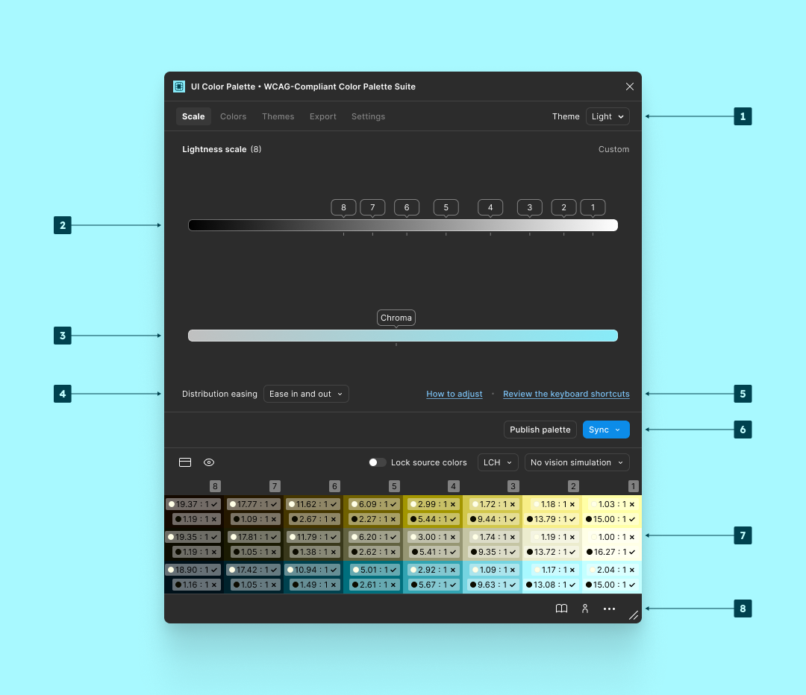
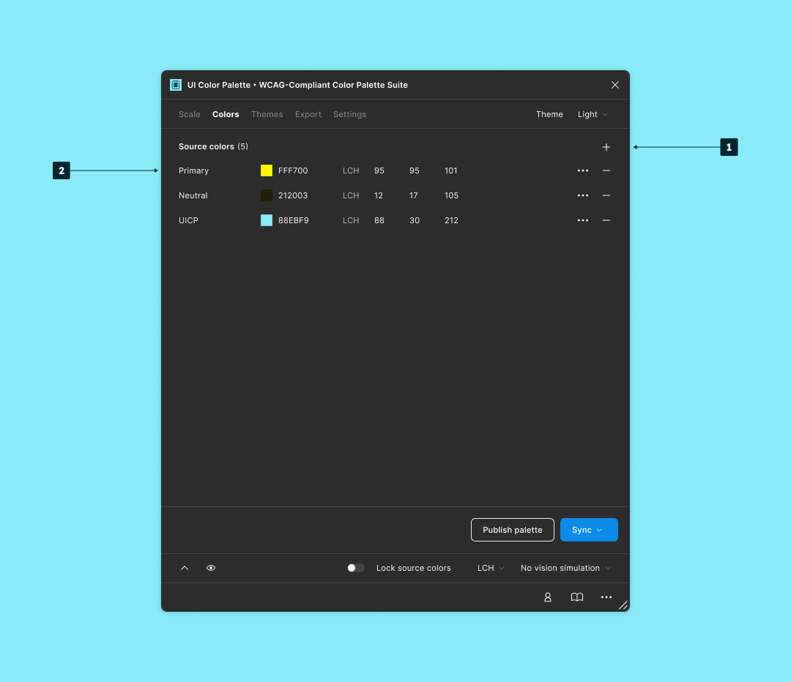
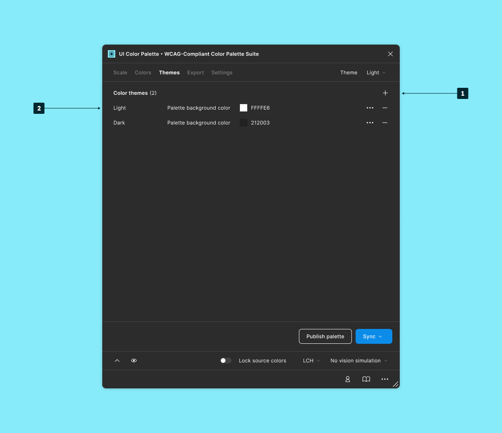

# Overview

<figure><figcaption>
<code>Scale</code>
</figcaption></figure>

1. Select a configured `Color theme`.
2. Adjust the `Lightness scale`'s stops.
3. Adjust the `Chroma`.
4. Select a `Distribution easing`.
5. `Review the keyboard shortcuts`.
6. Run the actions:
   * `Sync the local styles`: Sync the color shades with the document's local styles.
   * `Sync the local variables`: Sync the color shades with the documents' local variables.
   * `Publish palette` or `Synchronize palette`: Publication lifecycle of the palette
7. Watch a `Preview` of the palette and run:
   * Display [`WCAG 2.1`](../glossary.md#wcag-2.1) and [`APCA`](../glossary.md#apca) scores.
   * Lock the source colors.
   * Select the `Color space`.
   * Select a `Vision simulation`.
8. Access shortcuts:
   * Open the docs.
   * Open `User menu`.
   * Open `Help/Support menu`.

***

<figure><figcaption>
<code>Colors</code>
</figcaption></figure>

1. Add a new color to the palette.
2. Adjust the `Source colors` (from the left to the right):
   * Color name.
   * Hexadecimal code.
   * `Hue` shifting.
   * Advanced options:
     * [`LCH`](../glossary.md#lch).
     * `Chroma` shifting.
     * Description.
   * Remove.

***

<figure><figcaption>
<code>Theme</code>
</figcaption></figure>

1. Add a new theme to the palette.
2. Adjust the `Color themes` (from the left to the right):
   * Theme name.
   * Palette background color.
   * Advanced options:
     * Description.
   * Remove.

***

<figure><figcaption>
<code>Settings</code>
</figcaption></figure>

1. Adjust your `Palette` settings or your `Preferences`.
2. Change the palette `Name`.
3. Change the palette `Description`.
4. Change the palette `Layout`.
5. Select the `Color space`.
6. Select a `Vision simulation`.
7. Select the `Chroma velocity.`
8. Adjust the `Text light color`.&#x20;
9. Adjust the `Text dark color`.
