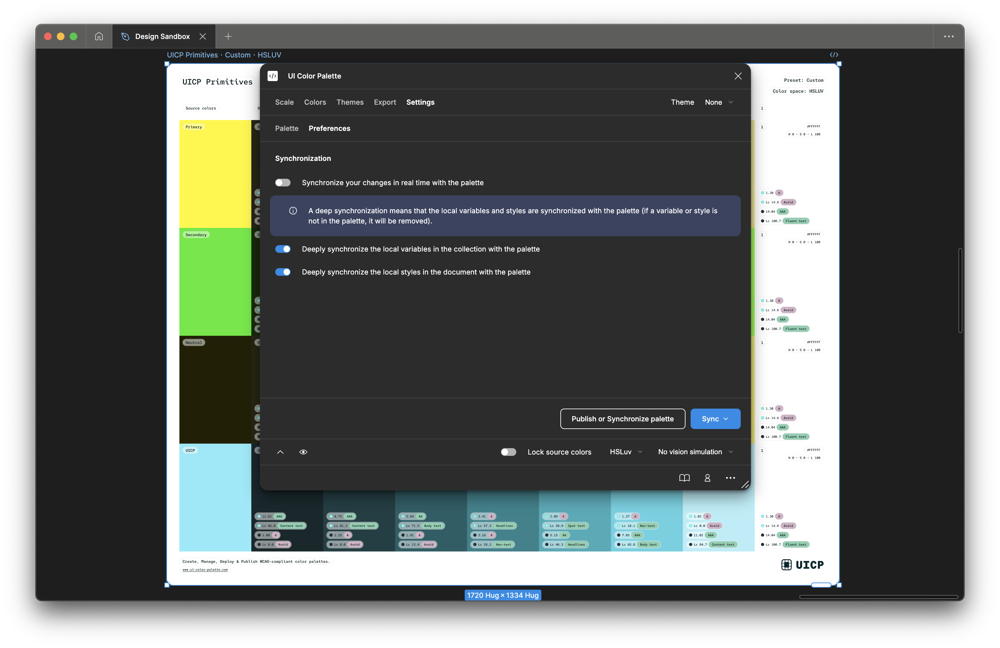

# Update your preferences

<figure><figcaption></figcaption></figure>

You can configure your `Preferences` in the `Settings` section when managing a color palette.

There are three preferences:

* The synchronization behavior between your configuration and the palette. By default, your configuration is pushed to the palette, ensuring a better performance when:
  * You released a `Lightness scale` stop.
  * You picked a new source color value.
  * You picked a new palette color for your theme.
* The synchronization behavior between the palette and local variables.\
  If enabled, the variables in the collection matching the shades in the palette are updated, and every variable that does not match a shade is deleted. The collection name will be the palette one.\
  If disabled, every variable that does not match a shade is preserved.
* The synchronization behavior between the palette and local styles.\
  If enabled, the variables in the collection matching the shades in the palette are updated, and every style that does not match a shade is deleted. The group name will be the palette one.\
  If disabled, every style that does not match a shade is preserved.
