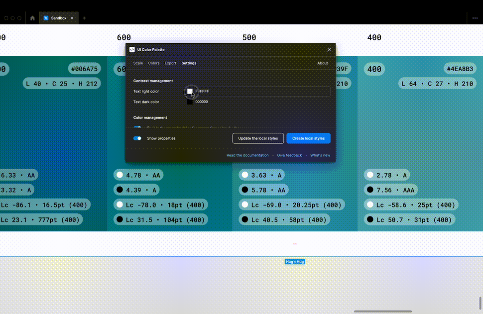

# UI Color Palette 21

## Key Feature

### Customize the text colors to align your branding with accessibility standards

<figure><figcaption></figcaption></figure>

Enhance your palette customization by editing the text colors used for the contrast score, surpassing the restrictions of using pure black and white. This ensures that your palette remains accessible, aligns with your brand's style, and complies with the WCAG and APCA standards.

## Minor Changes

### Streamline the process of copying the export preview

You can effortlessly select the entire export preview and conveniently copy and paste it into your desired document.

### Generate a fresh palette directly in your viewport

The newly created palette is thoughtfully positioned at the center of your viewport, ensuring your current work remains easily accessible and uninterrupted.

## Bugs Fixes

* You can find the appropriate preset when selecting a palette and running the plugin.
