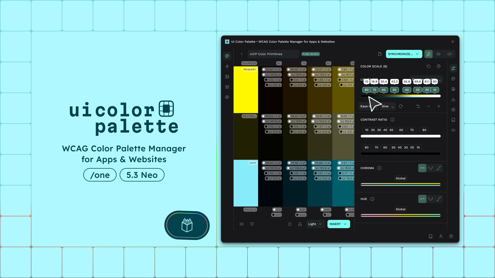

# UI Color Palette for Penpot

<figure><figcaption></figcaption></figure>

`UI Color Palette` is a `Penpot` plugin that creates, manages, deploys, and publishes consistent and accessible color palettes. The plugin uses alternative color spaces, like [`LCH`](https://docs.ui-color-palette.com/general/glossary#lch), [`OKLCH`](https://docs.ui-color-palette.com/general/glossary#oklch), [`CIELAB`](https://docs.ui-color-palette.com/general/glossary#cielab), [`OKLAB`](https://docs.ui-color-palette.com/general/glossary#oklab), and [`HSLuv`](https://docs.ui-color-palette.com/general/glossary#hsluv), to create color shades and tints based on the configured lightness scale. These spaces ensure [WCAG standard](https://www.w3.org/WAI/standards-guidelines/wcag/) compliance and sufficient contrast between information and background color.

This plugin will allow you to:

* Create a complete palette from any existing color to help you build a color scaling (or [`Primitive colors`](https://docs.ui-color-palette.com/general/glossary#primitives))
* Manage the color palette in real-time to control the contrast
* Sync the color shades/tints with local styles
* Generate code in various languages
* Publish the palette for reuse across multiple documents or add shared palettes from the community

For a quick start, you can refer to this demo:



And these pages:

<table data-view="cards"><thead><tr><th></th><th data-hidden data-card-cover data-type="files"></th><th data-hidden data-card-target data-type="content-ref"></th></tr></thead><tbody><tr><td>How to select source colors</td><td><a href=".gitbook/assets/quick_start-source_colors.png">quick_start-source_colors.png</a></td><td><a href="https://docs.ui-color-palette.com/general/guides/create-a-color-palette#create-from-source-colors">Create from source colors</a></td></tr><tr><td>How to scale colors</td><td><a href=".gitbook/assets/plans-basic.png">plans-basic.png</a></td><td><a href="https://docs.ui-color-palette.com/general/guides/create-a-color-palette#choose-a-lightness-scale-preset">Choose a lightness scale preset</a></td></tr><tr><td>How to change source colors</td><td><a href=".gitbook/assets/quick_start-change_source_colors.png">quick_start-change_source_colors.png</a></td><td><a href="https://docs.ui-color-palette.com/general/guides/manage-a-color-palette#change-the-source-colors">#change-the-source-colors</a></td></tr><tr><td>How to create styles</td><td><a href=".gitbook/assets/quick_start-change_styles.png">quick_start-change_styles.png</a></td><td><a href="guides/sync-a-color-palette-to-the-local-library.md#sync-to-the-local-styles">#sync-to-the-local-styles</a></td></tr><tr><td>How to create tokens</td><td><a href=".gitbook/assets/quick_start-variables.png">quick_start-variables.png</a></td><td><a href="guides/sync-a-color-palette-to-the-local-library.md#sync-with-tokens">#sync-with-tokens</a></td></tr><tr><td>How to generate code</td><td><a href=".gitbook/assets/quick_start-code_gen.png">quick_start-code_gen.png</a></td><td><a href="https://docs.ui-color-palette.com/general/guides/export-a-color-palette-to-code">Export a color palette to code</a></td></tr></tbody></table>
