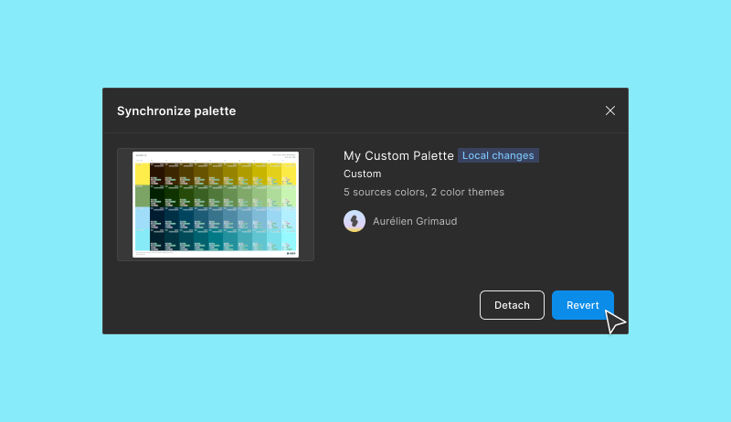

# 2️⃣ Publish and Synchronize palettes

There are two types of remote palettes: yours and the community. You cannot manage the lifecycle in the same way.

## Publish palettes

If the palette is yours, you can:

`Publish`: It makes it enter a lifecycle. If an update is detected, you can publish a new version.

<figure><figcaption></figcaption></figure>

* `Unpublish`: Remove it from the remote to make it local. The other instances will lose the link with the master and must be detached to remove the remote flag.

<figure><figcaption></figcaption></figure>

* `Revert`: Roll it back to the `Master`.

<figure><figcaption></figcaption></figure>

* `Synchronize`: Update it from the last version on the remote.

<figure><figcaption></figcaption></figure>

* `Detach`: Remove the link with the `Master` and make it local.

<figure><figcaption></figcaption></figure>

* `Share with the community`: The palette can be added by other members of UI Color Palette.

<figure><figcaption></figcaption></figure>

## Synchronize

If the palette is not yours, you can:

* `Synchronize`: Update it from the last version on the remote.

<figure><figcaption></figcaption></figure>

* `Revert`: Roll it back to the `Master`.

<figure><figcaption></figcaption></figure>

* `Detach`: Remove the link with the `Master` and make it local.

<figure><figcaption></figcaption></figure>

