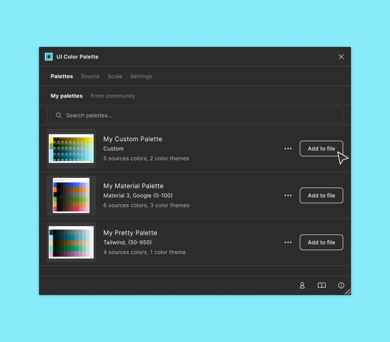

# 3️⃣ Reuse palettes across multiple documents

## Reuse the palettes for your own usage

You can go to `Palettes` then `Your palettes`. This list gathers all the live palettes you have published. From this list, you can:

* `Unpublish`: Remove the Master palette from the remote. This action is irreversible.
* `Add to file`: A palette instance is pushed to the document. It can be updated and republished later.
* `Search palettes…`: Quickly go to a palette that is precisely known.

<figure><figcaption></figcaption></figure>

## Hunt the shared palettes from the community

You can go to `Palettes`, then `From the community`, to retrieve a list of shared palettes provided by `UI Color Palette` Users. These palettes keep a link to their `Master` and can be synchronized if the user publishes a new version. You must click `Synchronize palette` to check the status.

From the list, you can:

* `Add to file`: A palette instance is pushed to the document. It can be updated and republished later.
* `Search palettes…`: Quickly go to a specific palette or a group of palettes.
