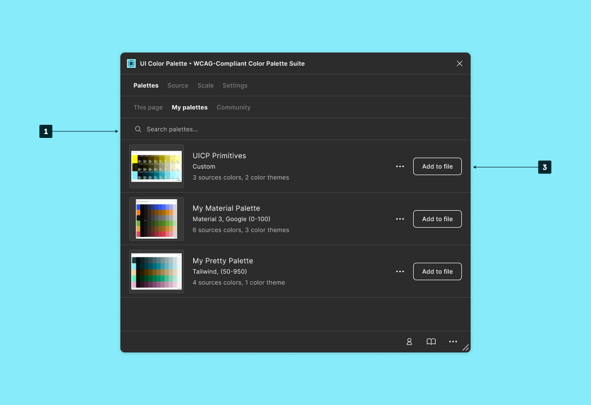

# Reuse the palettes for your own usage

You can go to `Palettes` then `Your palettes`. This list gathers all the live palettes you have published. From this list, you can:

* `Unpublish`: Remove the Master palette from the remote. This action is irreversible.
* `Share with the community` or `Remove from the community`: You allow other users to add your palette to their files.
* `Add to file`: A palette instance is pushed to the document. It can be updated and republished later.
* `Search palettes…`: Quickly go to a palette that is precisely known.

<figure><figcaption></figcaption></figure>
