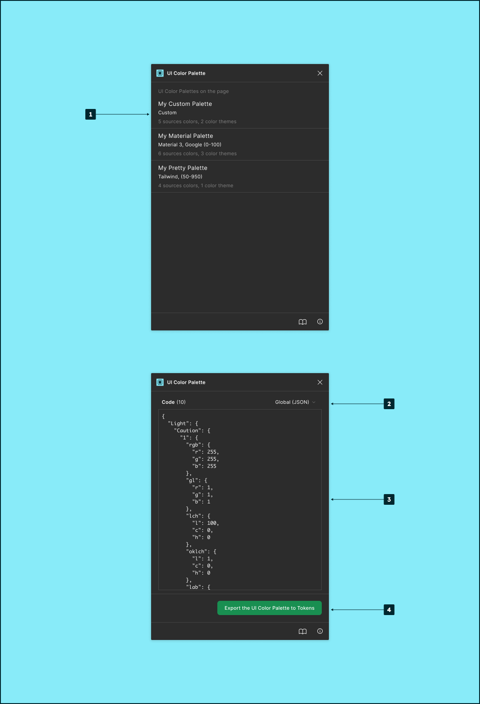

# Overview

<figure><figcaption></figcaption></figure>

1. List of available palettes on the current page. This list displays compact palette information that is:
   1. The name.
   2. The preset name.
   3. The number of source colors.
   4. The number of color themes.
2. Export file format.
3. Export preview.
4. Export the palette to the local machine.
