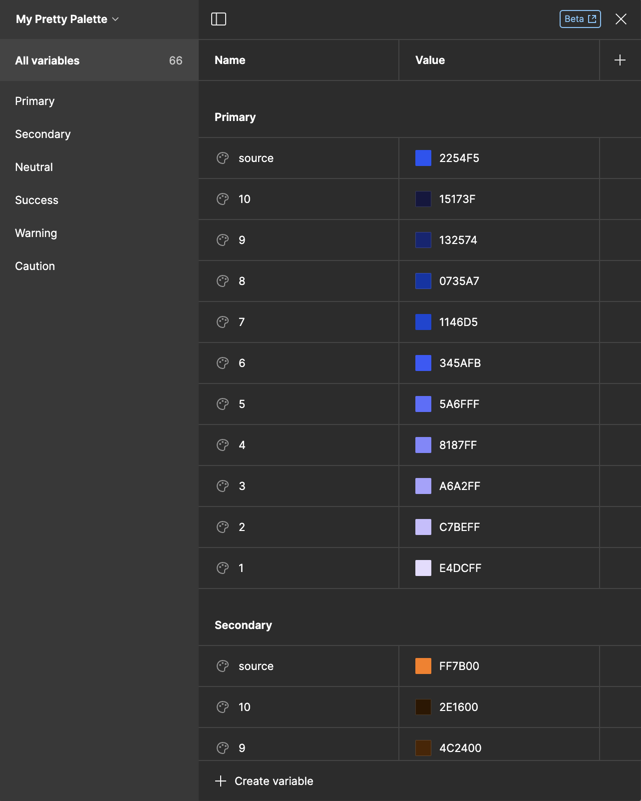
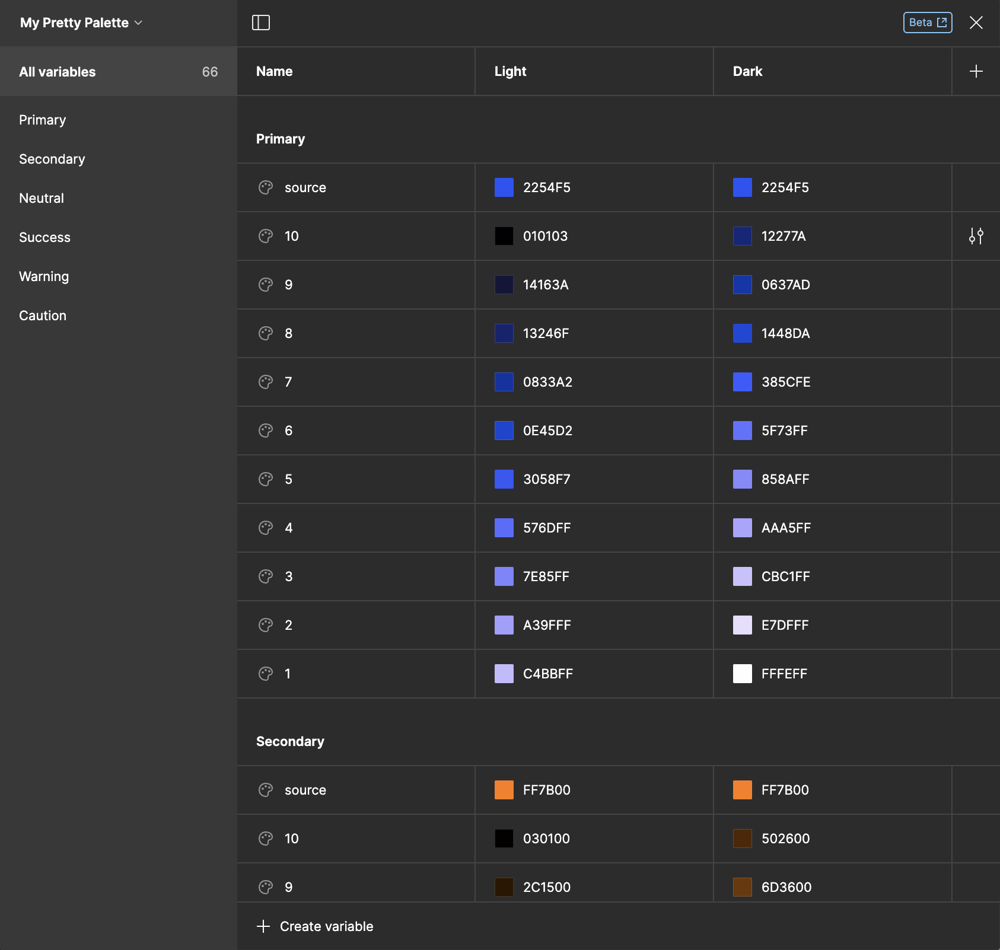

# Sync the palette to the local variables・Pro


Creating and updating local variables are only available in the Pro plan.


## Add the shades to the document's local variables

Once the palette is ready, select Manage local variable, then click the `Create local variables` button to add every color shade into the document's local variable. These variables can be published in the Team Library.

A new collection with the palette's name and a default mode named `Value` is created, and the shades are pushed from the darkest to the lightest and grouped by source colors. If any `Color themes` have been created, they are pushed as variable modes, and the empty cells are filled with shade [`RGB`](../glossary.md#rgb) values.

The description of the `Source colors` is reworked and added to the local variables description.


According to your Figma plan:

* In Figma Starter, you cannot add more than 1 variable mode.
* In Figma Professional and Organization, you cannot add more than 4 variable modes.

Learn more by consulting [Figma pricing](https://www.figma.com/pricing/).


<figure><figcaption>
Local variables created from a basic palette
</figcaption></figure>

 

<figure><figcaption>
Local variables created from a themed palette
</figcaption></figure>

## Update the document's local variables

Suppose you update the palette after adding its shades to the local variables, you can click the `Update the existing local variables` button to update the variables that have been edited. You must first push every shade before updating. The synchronization is not on both sides because you cannot update your palette from the local variables.


In case of editing, you should republish by hand the updated variables.

