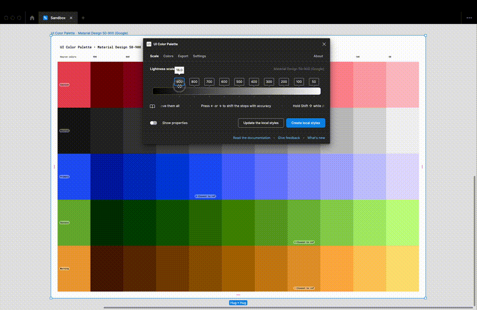
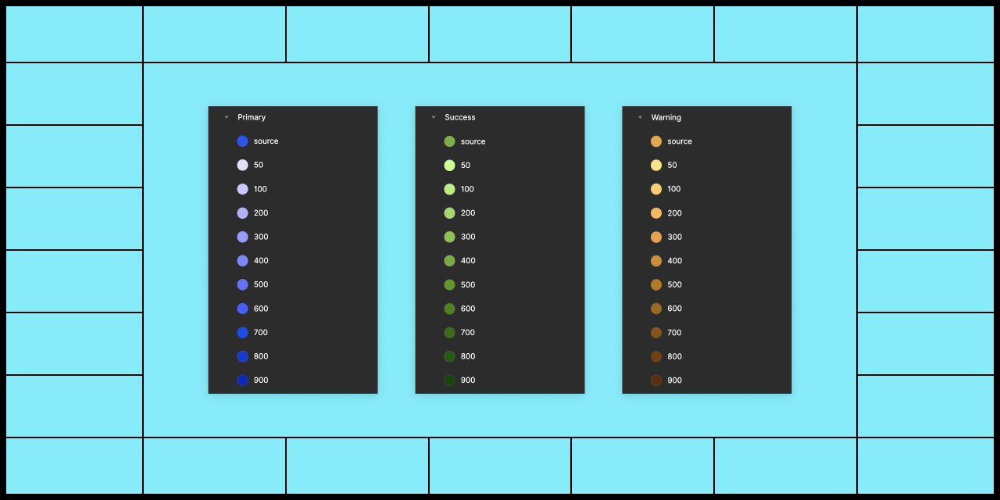
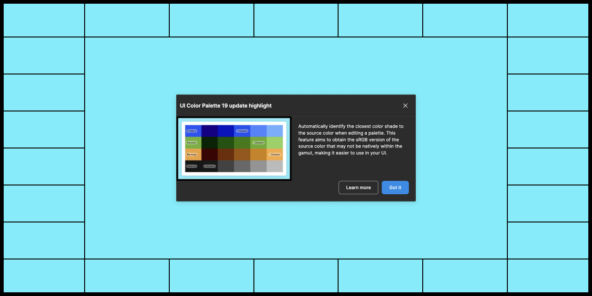

# UI Color Palette 19

## Key feature

### Watch the closest shade to the source color

<figure><figcaption></figcaption></figure>

Automatically identify the closest color shade to the source color when editing a palette. This feature aims to obtain the sRGB version of the source color that may not be natively within the gamut, making it easier to use in your UI.

## Improvements

### Include the source in the document local styles

<figure><figcaption></figcaption></figure>

Automatically include the source color in the document's local styles under the name "source" and place it before the color shades ordered according to the naming convention. This will help keep track of the origin and usage of the colors.

### Be advised of the updates

<figure><figcaption></figcaption></figure>

Stay informed of updates through the plugin, where you can read about the most important highlight of each upgrade. This makes it easier to follow the evolution of the tool and find new features that better meet your needs.

## Minor changes

### Source colors is the new Starting colors

The term "Source colors" is now used instead of "Starting colors." This change was made to more appropriately refer to the selected colors, such as brand colors.

### The shortcuts bar is available everywhere

Find the main shortcuts to read the documentation, give feedback and reset the main highlight without selecting colors or a palette.
