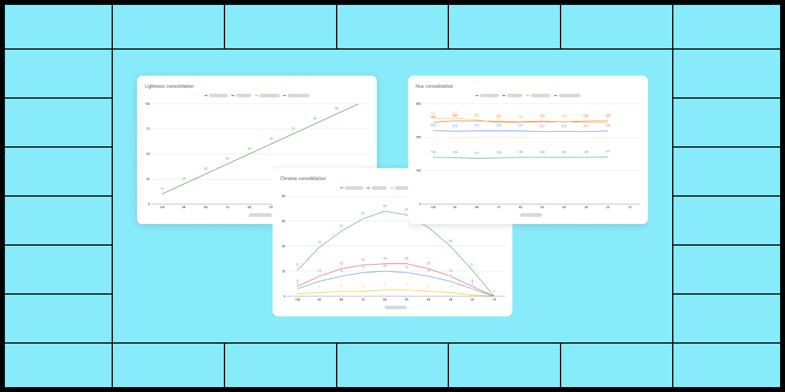

# UI Color Palette 20

## Key Feature

### Enable the new color shades generation process

<figure><figcaption></figcaption></figure>

This update improves the consistency of your palette's lightness and saturation by enhancing the color shade generation process. The new algorithm is automatically used for new palettes, and you can enable it for your existing palettes in the settings.

## Improvements

### Export the LCH values of the palette into a CSV file

<figure><figcaption></figcaption></figure>

You can now export the palette LCH values into CSV to create your own report using your preferred software (such as Excel, Numbers, or Sheets) to compare the color shades and aid in your decision-making process.

## Minor Changes

### Press esc. to unselect a lightness stop&#x20;

You can press the esc. key to unselect a lightness stop in addition to clicking outside.

## Bugs Fixes

* After disabling the properties display option, changing the preset and updating the stops now works as expected
