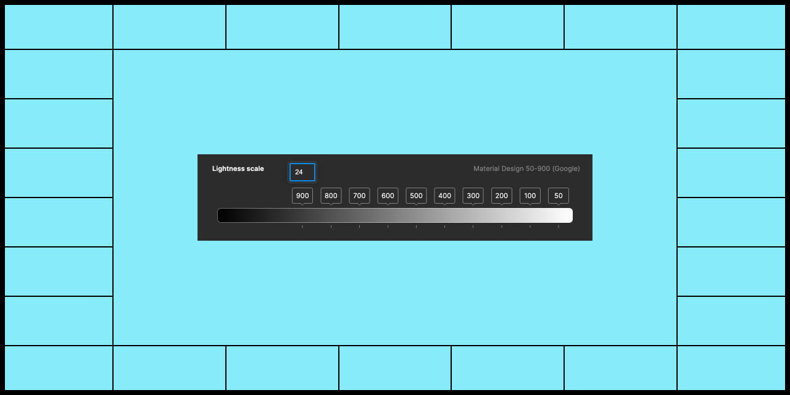
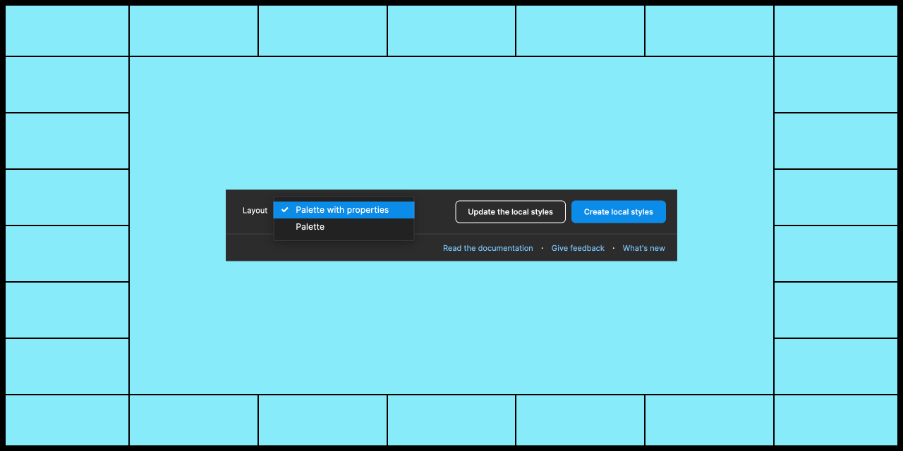

# UI Color Palette 22

## Key Feature

### UI Color Palette on Figjam!



Newly extended to Figjam, the UI Color Palette plugin empowers designers to create and customize their UI color schemes at the start of the design process, providing greater flexibility to their workflow and enhancing their creative potential.

## Improvements

### Get the lightness scale to the next level

<figure><figcaption></figcaption></figure>

You can now enter the value of a lightness stop manually in the color palette, providing greater precision. Besides, the stops really freeze when the scale has been edited.

### Say welcome to Layouts

<figure><figcaption></figcaption></figure>

You can switch the UI cxolor palette layout to suit your needs. Choose a simple palette for editing the scale and colors, as well as a detailed one for controlling contrast. There will be more layouts soon. 😉

## Minor Changes

* We have improved the display of the dropdown menu, allowing it to fit within its area
* The UI Color Palette has been restructured, separating the source from the shades and renaming "\_basics" to "\_base"
* Messages for notifications have been updated when creating and updating local styles
* The label "an UI" has been corrected to "a UI"
* The color indicator in the accessibility score has been accentuated for better visibility if the text color is too light
* Properties previously labeled "white" and "black" have been renamed to "light" and "dark" for greater consistency

## Bug Fixes

* Editing colors is now possible when using Figma on a native browser
