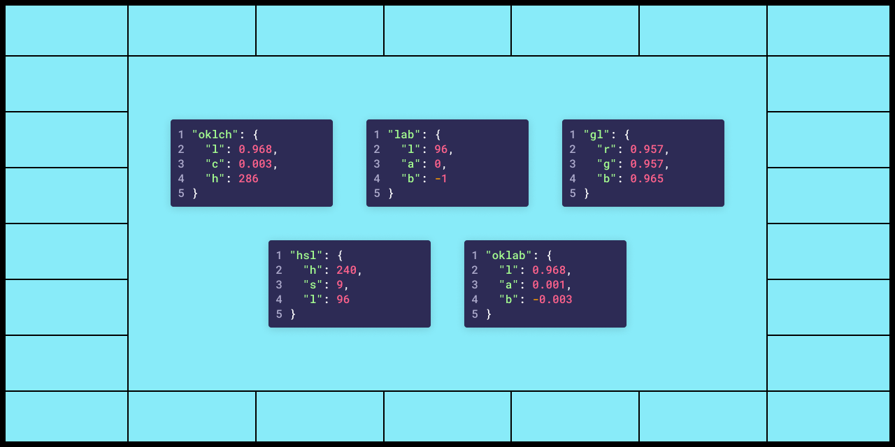

# UI Color Palette 23

## Key Feature



Color Spaces can be managed throughout the UI Color Palette. This allows you to select and switch between a variety of color spaces such as LCH, OKLCH, LAB, OKLAB, and HSL. By doing so, you can ensure that the contrast and lightness of your designs are consistent, especially when using the OKLCH and OKLAB color spaces. Furthermore, managing color spaces in the UI Color Palette provides a more efficient and streamlined workflow, allowing you to focus on the creative aspects of your design without having to worry about the technical details.

Furthermore, the HSL color space enables you to include the source colors in the palette, ensuring that you can retrieve your brand's color references.

## Improvements

### Get more color model in the tokens

<figure><figcaption></figcaption></figure>

In the tokens (JSON export), you can access more than just the RGB, LCH, and Hex values. The following additional color values are available for various color spaces:

* GL (useful for Apple OS color declarations)
* OKLCH
* CIELAB
* OKLAB
* HSL

## Minor Changes

* The controller displays the number of lightness stops
* The controller displays the number of source colors
* If the palette is empty, a message will invite you to add a source color
* Source color names are displayed at the top of the palette
* The lightness stop is emphasized when its input is open
* The exported file name will be based on the palette name
* The CSS Custom properties are separated with the source color name
* Stops are included as an object key rather than pushed into an array in the JSON export

## Bug Fixes

* The configuration for the lightness scale is applied to the newly created palette
* The CSV export function works, but if the palette has no source color, a warning will be returned
