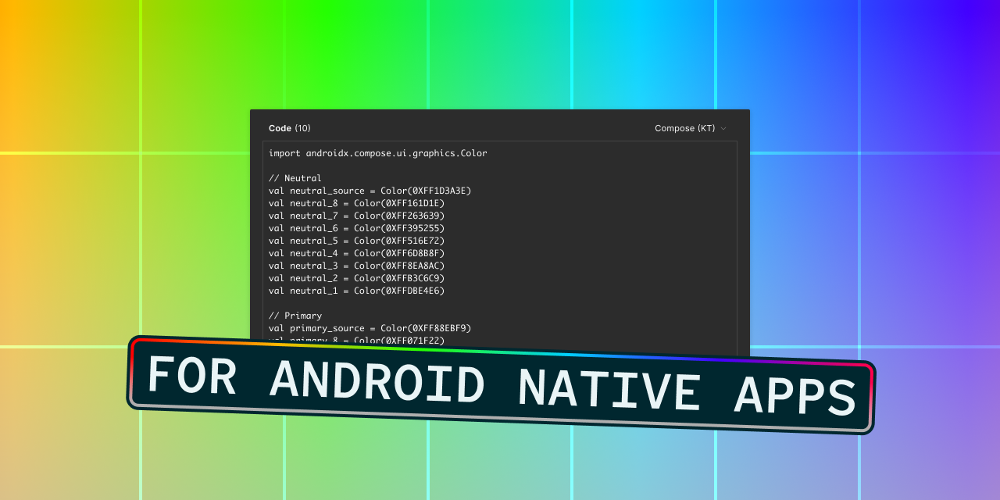
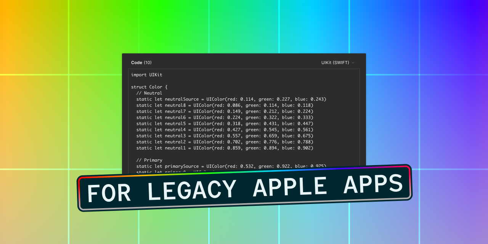

# UI Color Palette 30

## Key Feature



You can simulate color perception and contrast for different types of color blindness. This way, you can get a sense of how people with various color perception abilities might interact with your design. This step is key to making accessibility a part of your design process. By including this, you're making sure your design is not just good-looking, but also functional and accessible for everyone, including those with color vision deficiencies.

## Improvements

### Export in Compose

<figure><figcaption></figcaption></figure>

Jetpack Compose, a modern toolkit, streamlines Android UI development. It offers an efficient way to design native applications, boosting the development process and proving valuable for Android development.

### Export in UIKit

<figure><figcaption></figcaption></figure>

If your Apple project relies on UIKit, you can export specifically for it. This preserves your project's key aspects and ensures they work with UIKit. This is useful for developers wanting to maintain their project's integrity while leveraging UIKit's robust features.

## Minor Changes

* After selecting colors on your canvas, use the shortcut button to automatically run the plugin with the chosen source colors.
* Newly added features are highlighted.

## Bug Fixes

* The newly created color shades are synchronized as needed.
* The creation of variable modes is blocked without exception if the number of color themes exceeds the limit.
* The number of available export types has been corrected.

***

Also, we want to remind you that we're always listening to your [feedback and suggestions](https://uicp.link/feedback), and we've made sure to incorporate your most recent feedback into these updates to ensure that they're tailored to your needs.

You can now start a discussion to share your practices, write feedback, help the community, etc. [Get ready to write a topic!](https://uicp.link/discuss)

Besides, you can always get support by sending us an email at [hello@ui-color-palette.com](mailto:hello@ui-color-palette.com) and help us improve the quality of UI Color Palette by [reporting a bug](https://uicp.link/report).

Enjoy your updated UI Color Palette!

UI Color Palette Team
