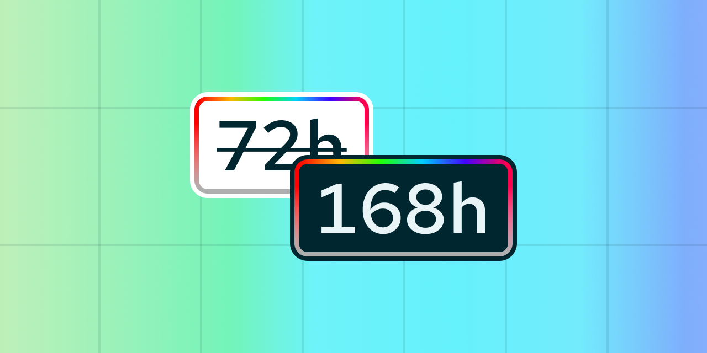
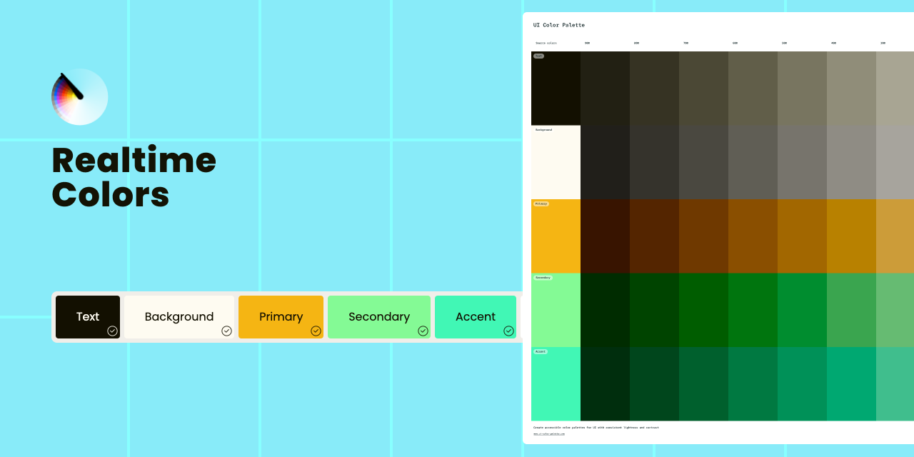

# UI Color Palette 31

## Key Feature



We have introduced the ability to export with Dev Mode. This feature allows users to export their work in a seamless and efficient manner. This is compatible with the Figma Desktop App, Browser App, and VS Code via the Figma extension!



## Improvements

### 7 Day Trial Period

<figure><figcaption></figcaption></figure>

We've confidently extended the trial period to an entire week. This empowers users with ample time to explore the premium features and cement their workflows.

### Import from Realtime Colors

<figure><figcaption></figcaption></figure>

We've introduced a feature that allows users to import from Realtime Colors. This addition streamlines the process of incorporating color variations into their color references document and scaling them to a color system.

## Minor Changes

* A new feature allows users to specify various types of color blindness, enhancing design accessibility.
* A dual-action button has been added, providing more functionality and control.
* Users can now reorder their shortcuts, aiding efficiency and productivity.
* We've enabled export to HSL, for work in the HSL color model.
* The code zone's scroll resets after a format change, ensuring users start at the top.

## Bug Fixes

* A bug which interfered with palette creation using parameters has been fixed. This ensures that palette creation can proceed without problems.

***

Also, we want to remind you that we're always listening to your [feedback and suggestions](https://uicp.link/feedback), and we've made sure to incorporate your most recent feedback into these updates to ensure that they're tailored to your needs.

You can now start a discussion to share your practices, write feedback, help the community, etc. [Get ready to write a topic!](https://uicp.link/discuss)

Besides, you can always get support by sending us an email at [hello@ui-color-palette.com](mailto:hello@ui-color-palette.com) and help us improve the quality of UI Color Palette by [reporting a bug](https://uicp.link/report).

Enjoy your updated UI Color Palette!

UI Color Palette Team
