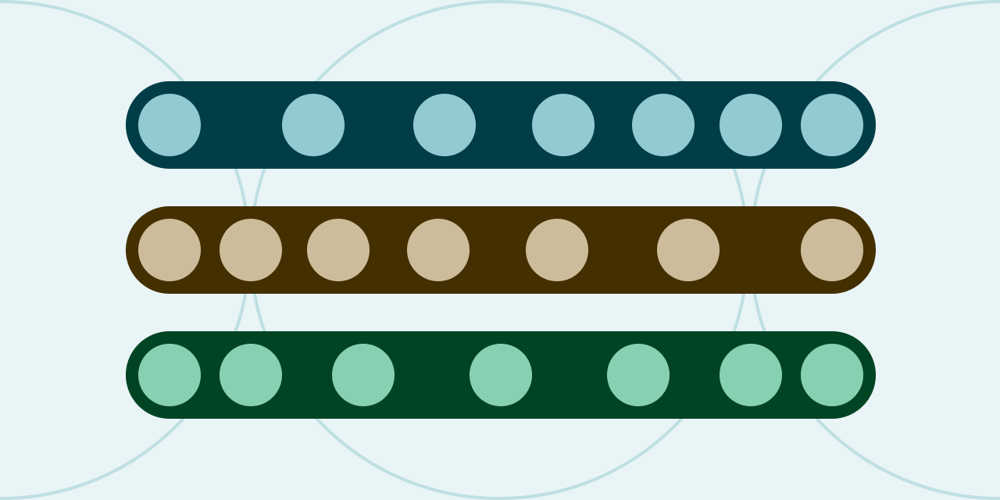
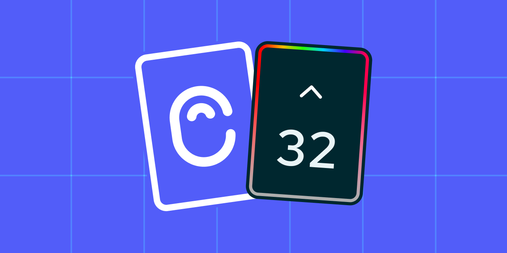
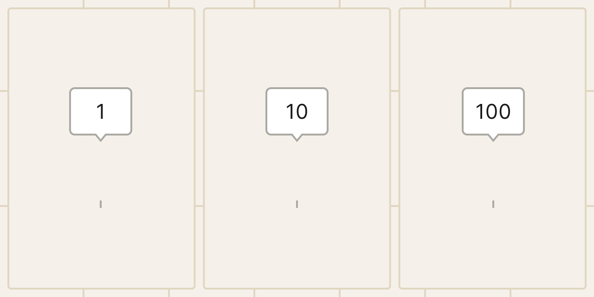

# UI Color Palette 32



## Key Feature

### Stops Distribution Easing

<figure><figcaption></figcaption></figure>

You can distribute stops using pre-configured easing such as "ease" or "ease-in". This method provides a quick way to evenly distribute them across the range, thereby enhancing harmonized color scaling.

## Improvements

### **Canny Forefront Integration**

<figure><figcaption></figcaption></figure>

Canny has been emphasized and prioritized. This promotes user feedback and increases the visibility of community discussions, creating a more interactive and communicative user experience.

### **Custom Naming Convention**

<figure><figcaption></figcaption></figure>

The naming convention within the Custom preset can be adjusted to either increase or decrease the stop number (from 1-10, 10-100, or 100-1000). This option is only available when creating a palette.

### **Scale Tips Simplification**

The tips for using color scaling editing have been clarified and simplified. This update is designed to make these tips easier to understand, providing users with guidance on adjusting the lightness scale with fewer actions.

### **Migration to Dynamically Load Pages**

A migration to Dynamically Load Pages has been implemented. This development is designed to improve the speed and responsiveness of the document, thus reducing load times.

## Minor Changes

* Users can click outside a dialog box to close it.
* A cursor has been integrated to signify the addition of a stop.

## Bug Fixes

* An issue that was preventing the creation of a palette with properties using Quick Action has been resolved.

***

Also, we want to remind you that we're always listening to your [feedback ](https://uicp.link/feedback)and also your [feature requests](https://uicp.link/feature-requests) and we've made sure to incorporate your most recent feedback into these updates to ensure that they're tailored to your needs.

Besides, you can always get support by sending us an email at [hello@ui-color-palette.com](mailto:hello@ui-color-palette.com) and help us improve the quality of UI Color Palette by [reporting a bug](https://uicp.link/report).

Enjoy your updated UI Color Palette!

UI Color Palette Team
