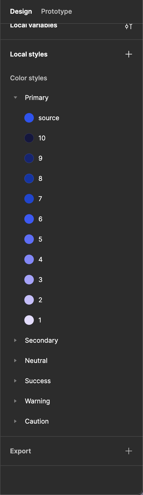
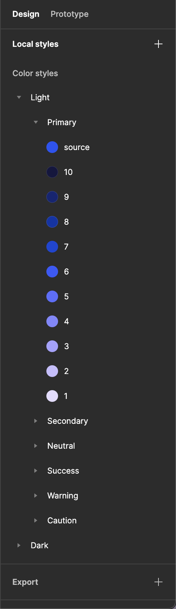
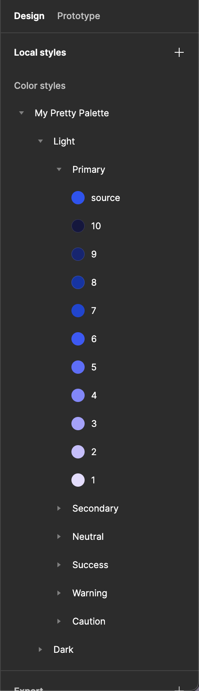

# 🔐 Sync the palette to the local styles


Creating and updating local styles are only available in the <mark style="color:yellow;">`Pro`</mark> plan.


The shades are grouped by source colors, from the darkest to the lightest. If any `Color themes` have been created, the groups will be gathered and named with their related color theme. In addition, if the palette has a custom name, every group is gathered into one with the palette name.

Once the palette is ready, click the `Sync with the local styles` button to add every color shade to the document's local styles. These styles can be published in the Team Library.

If you update the palette after adding its shades to the local styles, you can click the `Sync with the local styles` button to update the styles that have been edited. The synchronization is not on both sides because you cannot update your palette from the local styles.


In case of editing, you should republish by hand the updated variables.


<figure><figcaption>
Local styles created from a basic palette
</figcaption></figure>

 

<figure><figcaption>
Local styles created from a themed palette
</figcaption></figure>

 

<figure><figcaption>
Local styles created from a themed and named palette
</figcaption></figure>

