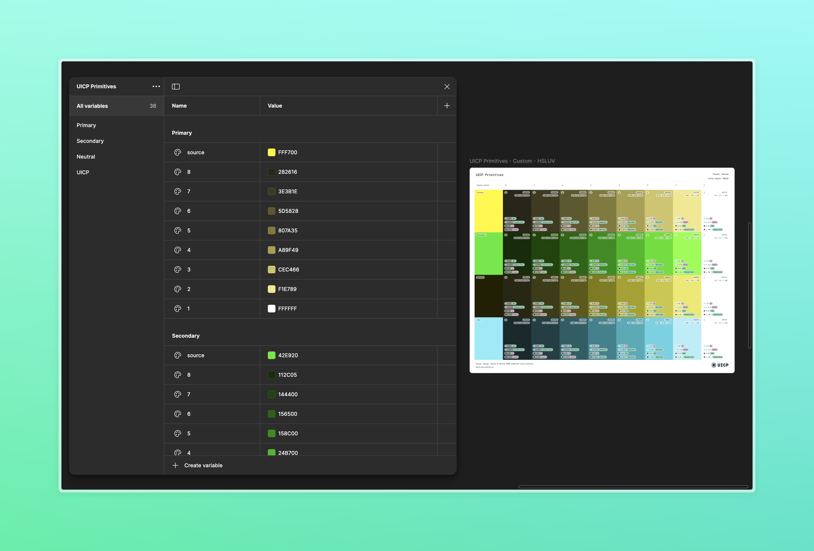
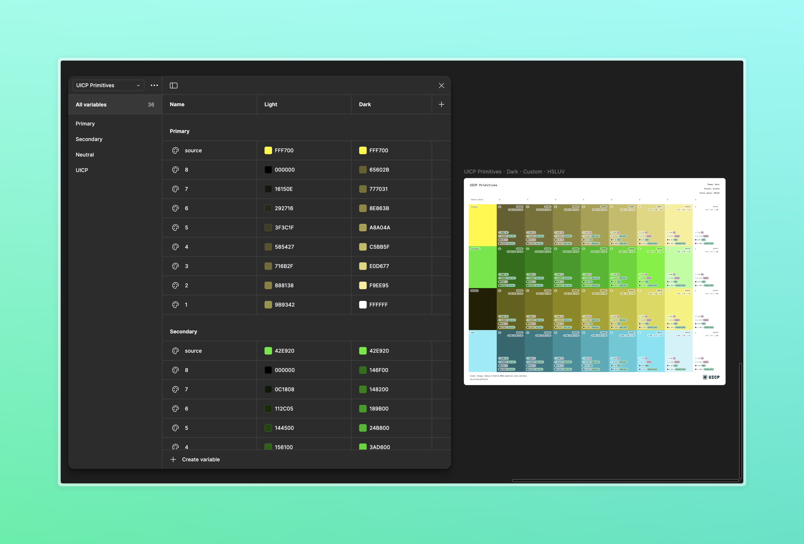

# Sync the palette to the local variable・Pro


Creating and updating local variables are only available in the <mark style="color:yellow;">`Pro`</mark> plan.


Once the palette is ready, select Manage local variable, then click the `Sync with the local variables` button to add every color shade into the document's local variable. These variables can be published in the Team Library.

A new collection with the palette's name and a default mode named `Value` is created, and the shades are pushed from the darkest to the lightest and grouped by source colors. If any `Color themes` have been created, they are pushed as variable modes, and the empty cells are filled with shade [`RGB`](../glossary.md#rgb) values.

The description of the `Source colors` is reworked and added to the description of the local variables.


According to your Figma plan:

* In Figma Starter, you cannot add more than 1 variable mode.
* In Figma Professional and Organization, you cannot add more than 4 variable modes.

Learn more by consulting [Figma pricing](https://www.figma.com/pricing/).


Suppose you update the palette after adding its shades to the local variables, you can click the `Sync with the local variables` button to update the variables that have been edited. The synchronization is not on both sides because you cannot update your palette from the local variables.


The synchronization with the local variables is deep by default, so the variables that do not match the shade of your palette will be deleted. Read more about the [`Preferences`](../manage-a-color-palette/update-your-preferences.md).


<figure><figcaption>
Local variables created from a basic palette
</figcaption></figure>

<figure><figcaption>
Local variables created from a themed palette
</figcaption></figure>
