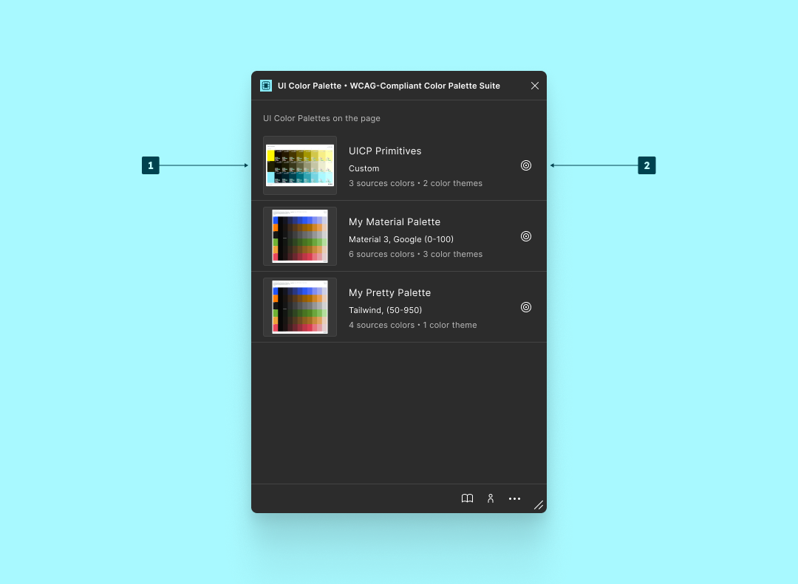
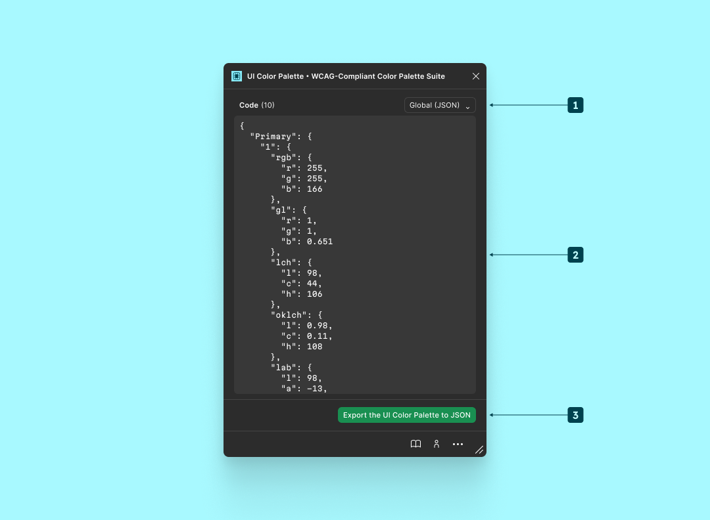
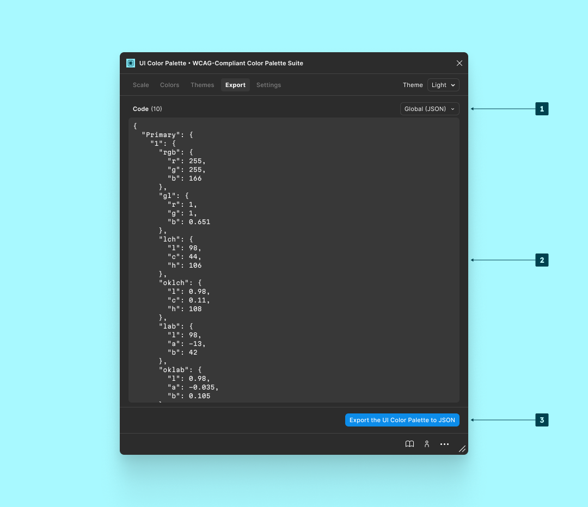

# 👀 Overview

<figure><figcaption>
<code>Find</code>  in <code>Dev Mode</code>
</figcaption></figure>

1. List of available palettes on the current page:
   * The name.
   * The preset name.
   * The number of source colors.
   * The number of color themes.
2. Select and target the palette.

***

<figure><figcaption>
<code>Export</code> in <code>Dev Mode</code>
</figcaption></figure>

<figure><figcaption>
<code>Export</code>
</figcaption></figure>

1. Export file format.
2. Export preview.
3. Export the palette to the local machine.
