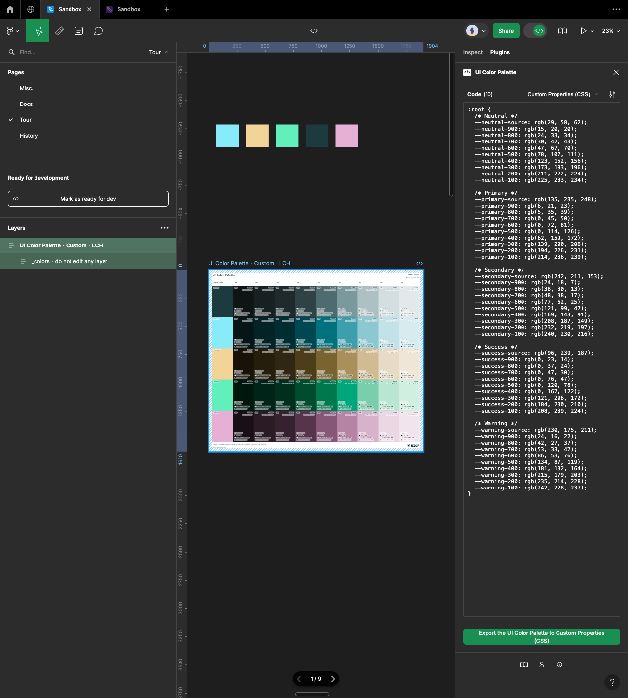
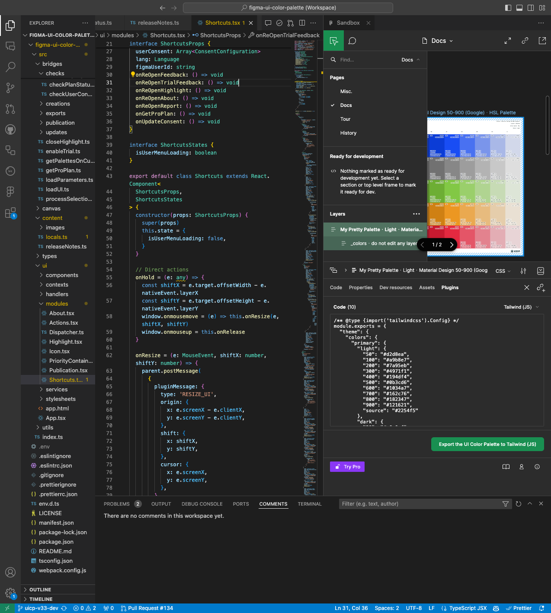

# 2️⃣ Usage in Dev Mode

The plugin is suitable in Dev Mode for developers who cannot edit content outside of this. Indeed, you can find an exhaustive list of the available palettes on the current page. Designers manage palettes' status, bringing the `Ready for dev` to the front of the list.

<figure><figcaption></figcaption></figure>

The Figma plugin in VS Code can make the palettes close to the code. First, you must install the [Figma plugin](https://marketplace.visualstudio.com/items?itemName=figma.figma-vscode-extension) via the VS Code marketplace and log in. Then, you can access the document to which you have permission.

<figure><figcaption></figcaption></figure>
